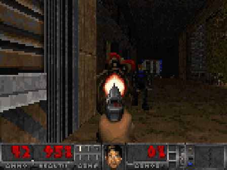
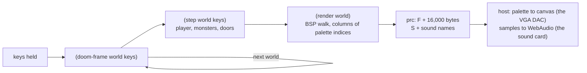

# Doom, in Paul Graham's Bel

> I was having dinner with Paul Graham and Tom Brown, cofounder of Anthropic, and we wanted to see if Opus 5.5 could make Doom in Bel. It did it before dessert came: about 25 minutes.
>
> — Garry Tan



**[Play it in your browser](https://garrytan.github.io/bel-doom/)** · [How the engine works](#doom-as-a-pure-function) · [How the interpreter works](docs/interpreter.md) · [The 25 minutes](#the-25-minutes)

In 2019 Paul Graham published [Bel](https://paulgraham.com/bel.html), a Lisp defined in itself: 1,800 lines of Bel that specify everything from `car` to the reader, the printer and the numbers. He was clear about what it was not:

> This is not a language you can use to program computers, just as the Lisp in the 1960 paper wasn't. Mainly because, like McCarthy's Lisp, it is not at all concerned with efficiency.

He meant it. In Bel, numbers are built from lists, and the integers in them are unary. Here is two thirds:

```lisp
(lit num (+ (t t) (t t t)) (+ () (t)))
```

So `(+ 2 2)` appends two lists of `t`. There is no floating point, no trig, no vector type (Bel's arrays are lists too), and no way to draw a pixel except writing bits to a stream.

This repository runs Doom in it. It plays Freedoom's E1M1 with BSP rendering, textured walls, floors and sky, light levels, sprites, zombiemen, imps and demons that see you, chase you and shoot back, the pistol, exploding barrels, doors, lifts, pickups, the status bar with Doomguy's face, and sound. The game is 1,729 lines of Bel, running on Paul Graham's unmodified `bel.bel`. The Bel is purely functional: there is no assignment and there are no loops anywhere in the engine.

## Doom as a pure function

The whole game is one value, the world. The host calls one function per tic, 35 times a second:

```lisp
(def doom-frame (w (o keys ""))
  (let w2 (step w keys)
    (if (at 'sounds w2)
        (pr (apply append (map [append "S" _ (list (nchar 10))] (rev (at 'sounds w2))))))
    (prc \F)
    (apply pr (render w2))
    w2))
```

`step` is the game and `render` is the picture. Both are pure functions:

```lisp
(def step (w keys)
  (update-hud
    (run-actors
      (run-movers
        (player-tic (puts w 'tic (+ 1 (at 'tic w)) 'sounds nil 'blasts nil) keys)))))
```

Every monster is a function from the world and a thing to a new world and a new thing, folded over the list of things:

```lisp
(def run-actors (w)
  (let (w2 . ms) (foldl (fn (m (w . acc))
                          (if (or (at 'info m) (in (at 'state m) 'anim 'die))
                              (let (w3 . m2) (think w m)
                                (cons w3 (if m2 (cons m2 acc) acc)))
                              (cons w (cons m acc))))
                        (cons w nil)
                        (at 'mobjs w))
    (run-blasts (puts w2 'mobjs (rev ms)))))
```

The renderer is Doom's: a front-to-back walk of the level's BSP tree, drawing each wall segment's columns between per-column clip bounds, with the clip state folded through the walk instead of mutated:

```lisp
(def render-node (n v st)
  (if (>= (caddr st) screen-w)
      st
      (= (car n) 'sub)
      (foldl (fn (sg st) (render-seg sg v st)) st (cadr n))
      (let ((tag x y dx dy rbox lbox right left) (px py . rest)) (list n v)
        (if (> (* dy (- px x)) (* dx (- py y)))
            (let st (render-node right v st)
              (if (box-visible lbox v (cadr st)) (render-node left v st) st))
            (let st (render-node left v st)
              (if (box-visible rbox v (cadr st)) (render-node right v st) st))))))
```

Even randomness is pure. Doom's `P_Random` reads from a fixed table of 256 bytes; here the table is a Bel list and the index travels inside the world, so the same keys always produce the same game. The only side effects in the program are reading the WAD file at startup and printing each finished frame.

`node tools/lint-idiom.mjs` checks this. It flags any `set`, `xar`, `push`, loop macro, `coin`/`rand`, or square-bracket function without `_` outside top-level definitions, and the engine passes with zero findings.

### What the engine does

| File | Lines | What it does |
|---|---|---|
| [`main.bel`](doom/main.bel) | 108 | entry points, screen constants, building the world |
| [`math.bel`](doom/math.bel) | 109 | sine, cosine, square root and arctangent from Taylor series and Newton's method, Doom's random table, property-list helpers |
| [`wad.bel`](doom/wad.bel) | 170 | WAD directory, palette, COLORMAP, composing wall textures from TEXTURE1/PNAMES patches, flats, sprites |
| [`level.bel`](doom/level.bel) | 164 | vertexes, linedefs, sidedefs, sectors, segs, subsectors, BSP nodes, a blockmap, line of sight |
| [`render.bel`](doom/render.bel) | 502 | the BSP renderer: view transform, near-plane clipping, perspective-correct textures with pegging, floors and ceilings, sky, light diminishing, fences and grates, sprites with 8 rotations clipped against walls, the weapon, damage and pickup tints |
| [`actors.bel`](doom/actors.bel) | 313 | zombieman, shotgun guy, imp and demon (sight, chase, attack, pain, death) and barrels with chain explosions |
| [`game.bel`](doom/game.bel) | 356 | movement, collision and stepping, the pistol with autoaim, doors, lifts, switches, walk-over triggers, pickups, status bar and face, death and respawn |

Bel has no arrays, so everything is lists. The frame is a list of 160 columns of 100 palette indices (Doom draws walls in columns too). Textures are lists of circular column lists, so wrapping around a texture costs nothing.

## Making a spec run

PG's `bel.bel` is a specification, and running it is a puzzle of its own: closures are lists, the environment is an association list, macros are first-class and expanded on every call, and the numbers are unary. [`interp/bel.js`](interp/bel.js) is one dependency-free JavaScript file (about 2,400 lines) that runs it in Node and in browsers:

- **It loads `bel.bel` unmodified**, in about 45 ms, so every one of PG's definitions exists exactly as written. On the REPL session in PG's own [`belexamples.txt`](https://paulgraham.com/bel.html), all 37 results match.
- **Jets.** Then it swaps 87 hot definitions (`map`, `append`, `nth`, `+`, the reader, the printer...) for native functions with the same behavior. The term comes from Urbit, which does the same thing to its own definitional language.
- **CDR-coding.** Lisp Machines made lists fast by laying them out as vectors. Here, a list that gets indexed repeatedly quietly grows a hidden vector of its cells, so `nth` becomes constant time, and changing the list's structure throws the vector away. This is what makes texture lookups affordable.
- **A compiler.** Code is compiled once into JavaScript closures, with tail calls trampolined, so Bel loops written as recursion run in constant stack.
- **Native core macros.** `fn`, `let`, `set`, `for` and friends run natively for as long as they still mean what `bel.bel` says they mean. Redefine one, or bind the name locally, and yours is used.

Everything is real Bel underneath: `(lit clo env parms body)` closures you can take apart with `car`, a `scope` that is a real alist, `where` locations that work through function bodies, `ccc`, `dyn`, `after`, tables, arrays and intrasymbol syntax like `y!a` and `car:cdr`. The full reference is [docs/interpreter.md](docs/interpreter.md).

### Is it really Bel?

Almost. The deliberate differences:

- **Numbers are IEEE doubles**, not unary rationals. Doom needs millions of multiplications a second, and unary multiplication of 320 by 200 builds a list of 64,000 `t`s.
- **Continuations are escape-only** (enough for `catch`, `onerr` and early exits), and **threads are not supported**.
- **Macro expansions are memoized per call site**, which assumes a macro's expansion depends only on its arguments. That is true of every macro in `bel.bel`.

That's the whole list. Everything else, including the error behavior, parameter destructuring, optional and type-checked parameters and the way `set` finds places, is `bel.bel`'s own code or behaves identically to it.

## The 25 minutes

Opus 5.5 ran as a small team of agents in [Capy](https://capy.ai): one wrote the interpreter, one wrote the engine, and one wrote the browser, terminal and video front ends. GPT-6 Astra reviewed the plan partway through as an outside critic and found five interpreter bugs, all fixed. From the git log, in Pacific time:

| Time | Minute | |
|---|---|---|
| 7:11pm | 0 | "Implement Doom in Paul Graham's Bel" |
| 7:20 | 9 | The interpreter loads the unmodified `bel.bel` and passes its first tests |
| 7:24 | 13 | First frames of E1M1 in the browser: textured walls, sky, movement |
| ~7:34 | 23 | Textured floors, the pistol, the status bar with Doomguy's face, monsters shooting back, sound |
| 7:42 | 31 | Doors, lifts, barrels and pickups committed |
| 8:13 | 62 | Rewritten as pure functional Bel after Garry asked for idiomatic Lisp: no side effects, recursion instead of loops |
| 8:39 | 88 | Line of sight through doorways, door reversal, a reproducible demo route |

The functional rewrite renders the same frames, byte for byte, as the imperative version it replaced (checked on a scripted walk at both resolutions), at about the same speed.

## Numbers

| | |
|---|---|
| Live in a browser (headless Chromium, 4-core VM, while screen-recording) | 23-26 frames a second at 160x100 |
| Engine alone in Node | about 41 ms a frame at 160x100, 128 ms at 320x200 |
| Startup (boot Bel, parse the WAD, compose textures) | about 3.5 s |
| Engine | 1,729 lines of Bel (1,350 without comments and blank lines) |
| Interpreter | about 2,400 lines of JavaScript, no dependencies |
| Interpreter tests | 108/108, and 37/37 on `belexamples.txt` |

The default is Doom's low-detail mode, 160x100. Add `?hires=1` for the full 320x200.

## Run it

```sh
git clone https://github.com/garrytan/bel-doom && cd bel-doom
node bin/serve.mjs 8080          # open http://localhost:8080
node bin/doom-term.mjs           # or play in a terminal, with truecolor half-block pixels
```

Keys: arrows or WASD move and turn, Q/E strafe, Shift runs, Ctrl or F fires, Space or U opens doors, M mutes, Esc pauses. The only requirement is Node (tested with Node 24); there is nothing to install.

Bel on its own:

```sh
node bin/bel.mjs                                   # a REPL
node bin/bel.mjs -e '(map [* _ _] (list 1 2 3))'   # (1 4 9)
```

Recording:

```sh
node bin/doom-record.mjs --mp4 demo.mp4 --gif demo.gif     # scripted run, with sound
bin/make-demos.sh                                          # the demo video and a real-time browser capture
node bin/demo-bot.mjs                                      # regenerate the scripted route with a bot that plays the game
```

## How the pieces fit



The browser runs the interpreter in a Web Worker. The host's only jobs are the ones hardware did in 1993: turning palette indices into colors, playing the sound samples the game names, and reporting which keys are down. The protocol is in [docs/protocol.md](docs/protocol.md).

```
interp/   bel.js (the interpreter) and bel.bel (PG's spec, unmodified)
doom/     the engine, in Bel
web/      the browser front end
bin/      Bel CLI, terminal player, recorders, demo bot, static server
tools/    WAD builders, idiom lint, snapshot tool
test/     interpreter tests
wad/      Freedoom E1M1 and the sounds it uses (BSD)
docs/     interpreter reference, protocol
```

To rebuild the WADs from Freedoom 0.13.0: `FREEDOOM_WAD=path/to/freedoom1.wad python3 tools/mkwad.py` and the same for `tools/mksounds.py`.

## Known limits

- One level, E1M1. The pistol is the only weapon; shells and other weapons can be picked up but do nothing. Imp fireballs hit instantly instead of flying.
- Monster sight is range, facing and a clear line through the blockmap, with no REJECT table. Gunfire wakes monsters within 1,000 units instead of flooding through sectors.
- The blue key isn't required, and the exit switch takes you back to the start.
- Bel recursion runs on the JavaScript stack, so a browser worker fits about 1,000 nested non-tail calls. The engine uses tail recursion and `map`/`foldl` for long lists, which is also what *ANSI Common Lisp* advises for efficiency.

## Credits

Bel is by Paul Graham. The maps, textures, sprites and sounds are from [Freedoom](https://freedoom.github.io/) 0.13.0 (BSD license, see `wad/COPYING-freedoom.txt`). Doom is by id Software.

## Changelog

- 2026-10-06: README rewritten for a general audience; full interpreter reference in `docs/interpreter.md`; GitHub Pages entry point.
- 2026-10-05: First version: interpreter, functional Doom engine, browser, terminal and video front ends, sound.
