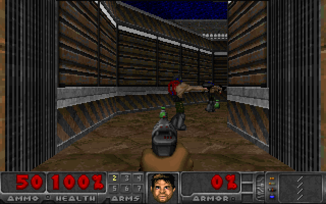

# Doom, written in Paul Graham's Bel

This repository runs Doom in [Bel](https://paulgraham.com/bel.html), the Lisp that Paul Graham defined in itself in 2019. It has two parts:

- **A Bel interpreter** (`interp/bel.js`, JavaScript, runs in Node and in browsers). It loads PG's `bel.bel` unmodified, so every definition in the spec exists exactly as he wrote it, and then makes the hot paths fast.
- **A Doom engine written in Bel** (`doom/*.bel`, about 1,700 lines). It reads Freedoom's E1M1 from a WAD file, walks the BSP tree, and draws textured walls, floors, sky, sprites and the status bar. Monsters, weapons, doors, lifts, pickups and sound events are all Bel too.
- **Written functionally**, in the style of `bel.bel` and *ANSI Common Lisp*: no assignment, no mutation, no loops. The whole game is one value, the world. `(step world keys)` returns the next world and `(render world)` returns the frame as a list of columns, both pure functions built from recursion, `map`, `foldl` and destructuring. The only side effects are reading the WAD and writing each finished frame. Even randomness is pure: Doom's own 256-entry table, indexed by a number carried in the world, as in the original `P_Random`.

The host programs are the "VGA card, sound card and keyboard". They turn the palette indices Bel writes into pixels, play the sound samples Bel names, and pass in the keys being held. No game logic lives outside Bel.



## Play it

```sh
node bin/serve.mjs 8080        # then open http://localhost:8080  (add ?hires=1 for 320x200)
node bin/doom-live.mjs --script-file bin/demo-route.txt --out live.mp4   # record the page in real time
bin/make-demos.sh              # both videos from bin/demo-route.txt (regenerate it with node bin/demo-bot.mjs)
node bin/doom-term.mjs         # in a terminal, with truecolor half-block pixels
node bin/doom-record.mjs --mp4 demo.mp4 --gif demo.gif   # scripted run to video, with sound
```

Keys: arrows or WASD to move and turn, Q/E or Alt+arrows to strafe, Shift to run, Ctrl or F to fire, Space or U to use, M to mute, Esc to pause.

A Bel REPL and script runner:

```sh
node bin/bel.mjs                         # REPL
node bin/bel.mjs -e '(map [* _ _] (list 1 2 3))'
node bin/bel.mjs file.bel
```

## What the engine does

Everything in this list is Bel code in `doom/`:

| File | What it does |
|---|---|
| `main.bel` | Entry points `(doom-init path)` and `(doom-frame world keys)`, screen constants, building the world |
| `math.bel` | sine, cosine, square root and arctangent, grown from Taylor series and Newton's method, because Bel has no math library |
| `wad.bel` | WAD directory and lumps, PLAYPAL, COLORMAP, TEXTURE1/PNAMES patch compositing, flats, sprites |
| `level.bel` | Vertexes, linedefs, sidedefs, sectors, segs, subsectors, BSP nodes, a blockmap-style grid |
| `render.bel` | Front-to-back BSP renderer: view-space transform, near-plane clipping, per-column clip state folded through the BSP walk, perspective-correct textured walls with pegging, textured floors and ceilings, sky, sector light and distance diminishing via COLORMAP, fake contrast, see-through fences and grates, sprites with 8 rotations clipped against walls, weapon, damage and pickup tints |
| `actors.bel` | Zombieman, shotgun guy, imp and demon: sight, chase, attack, pain and death states, barrels with chain explosions |
| `game.bel` | Player movement, collision and stepping, the pistol with bob, flash and hitscan autoaim, doors (1/26/117/31/118), walk-over triggers (2/88), lifts (62/88), switches (23, 11), pickups, status bar numbers and face, death and respawn |
| `hires.bel` | Constants for 320x200, loaded before `doom-init` |

Bel has no arrays, so the engine is built from lists. The frame protocol is column-major, which matches how Doom draws walls, so each column is a fresh list assembled from the runs of pixels above and below its open rows. Each thinker is a function from the world and a thing to a new world and thing, folded over the thing list. `tools/lint-idiom.mjs` checks the style: it reports any `set`, `xar`, `push`, loop macro, `coin`/`rand`, or a square-bracket function without `_` outside top-level definitions, and the engine passes with zero findings.

## What the interpreter does

- **Faithful core.** It implements Bel's primitives (`id join car cdr type xar xdr sym nom wrb rdb ops cls stat coin sys`) and special forms (`quote lit if apply where dyn after ccc`). Closures are real lists of the form `(lit clo env parms body)`, macros are `(lit mac clo)`, and the lexical environment is a real alist, so `scope` works. Lookup goes dynamic, then lexical, then global, as in the spec. `where` locations work through function bodies, so `(set (cadr x) 1)` and `(pop (find pair w))` behave as in the guide.
- **Loads `bel.bel` unmodified.** That takes about 0.1 s at startup.
- **Jets.** After loading, 87 hot definitions from `bel.bel` (list functions, arithmetic, I/O, the reader and printer) are replaced by native functions with the same behavior.
- **Native core macros.** `fn do set def mac let rfn when unless and or case with withs for while repeat` are evaluated natively while their global values are still the ones `bel.bel` defined. If a program redefines or locally rebinds one, the program's version is used.
- **Closure compiler.** Code is compiled once into JavaScript closures with proper tail calls (trampolined), so Bel loops written as recursion run in constant stack.
- **CDR-coding cache.** In the spirit of the Lisp Machine, a list that is indexed repeatedly gets a hidden vector of its cells, so `nth` and `drop` become O(1). Changing the list's structure with `xdr` invalidates the vector.

### Deliberate differences from the spec

- Numbers are IEEE doubles instead of exact rationals and complex numbers (`(/ 1 3)` is `0.333…`). Approved for this project.
- `ccc` continuations are escape-only (they can be called while their extent is live). `thread` is not supported.
- Macro expansions are memoized per call site. This assumes a macro's expansion depends only on its form, which is true of every macro in `bel.bel`.
- `(type 1)` is `number`, not `pair`.

## Current results

| Check | Result |
|---|---|
| PG's `belexamples.txt` REPL session (`node test/examples.mjs`) | 37/37 results match (2/3 prints as a float) |
| Semantics tests (`node test/basics.mjs`) | 108/108 |
| Functional style (`node tools/lint-idiom.mjs`) | clean |
| Live in the browser, 160x100 (headless Chromium, 4-core VM, while screen-recording) | 23-26 fps wall-clock over 900-1,175 tic runs, page counter 25-34 fps |
| Engine only, 160x100, Node | ~40-46 ms per frame (22-25 fps) |
| Engine only, 320x200, Node | ~128 ms per frame (~8 fps) |
| Startup (bel.bel, engine, WAD parse, texture compositing) | ~3.7 s |

## Known limits

- One level (E1M1), skill 3. The pistol is the only weapon; shells and other weapons are picked up but do nothing. Imp fireballs hit instantly instead of flying.
- Monster sight is range, facing and a clear line through the blockmap; there is no REJECT table or sound propagation through sectors (firing wakes monsters within 1,000 units).
- The blue key is not required, and the exit switch respawns you at the start.
- The spectre is drawn as an ordinary demon. Barrel chains advance one tic per link.
- Bel recursion runs on the JavaScript stack. The Node tools start with a 7.8 MB stack; in a browser worker about 1,000 nested non-tail calls fit, so the engine uses tail recursion and `map`/`foldl` for long lists.

## Rebuilding the WADs

`wad/e1m1.wad` and `wad/sounds.wad` are generated from Freedoom 0.13.0 and checked in. To rebuild them, download `freedoom-0.13.0.zip` from the Freedoom releases on GitHub and run:

```sh
FREEDOOM_WAD=path/to/freedoom1.wad python3 tools/mkwad.py
FREEDOOM_WAD=path/to/freedoom1.wad python3 tools/mksounds.py
```

## Layout

```
interp/bel.js     the interpreter          interp/bel.bel   PG's spec, unmodified
doom/*.bel        the engine               wad/e1m1.wad     Freedoom E1M1 + needed resources (BSD)
web/              browser front end        wad/sounds.wad   Freedoom sound effects
bin/              CLI, terminal, recorder  tools/           WAD builders, snapshot tool
test/             interpreter tests        docs/protocol.md engine/host frame and sound protocol
```

## Credits

Bel by Paul Graham. Maps, textures, sprites and sounds from [Freedoom](https://freedoom.github.io/) 0.13.0 (BSD license, see `wad/COPYING-freedoom.txt`). Doom by id Software.

## Changelog

- 2026-10-06: First version: interpreter, functional Doom engine, browser, terminal and video front ends, sound.
